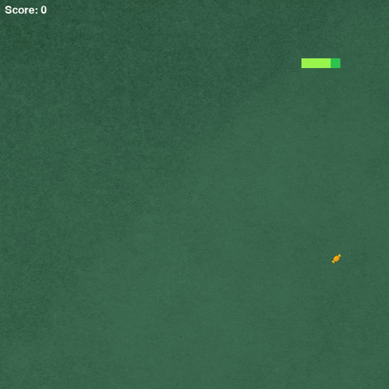

# **Snake game**

***

### Table of contents

* [General info](#general-info)
* [Game installation](#game-installation)
* [Technologies](#technologies)
* [Software license](#software-license)

***

### General info

This project is snake game.

***

### Game installation

*Only for Windows*
1. Download file **_snake-game.exe_** from **_release_**
2. Open file **_snake-game.exe_**
3. Chose destination folder where will be the game
4. Install
5. When installation process will be over, open folder with the game, then  open **_app_** folder
6. Run file **_Snake Game.exe_**
7. Enjoy the game!

***

### Technologies

Project is created with:
* Python 3.10.1
* pygame 2.1.2
* PyInstaller 4.10.

***

### Software license

MIT license

